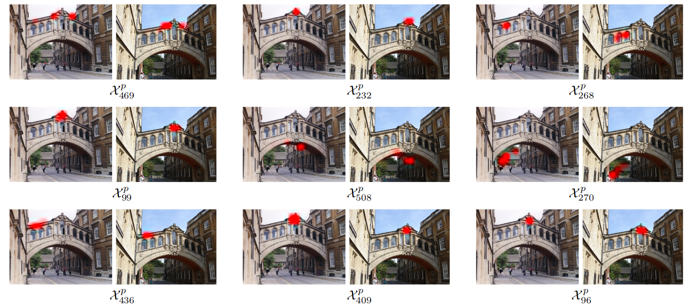
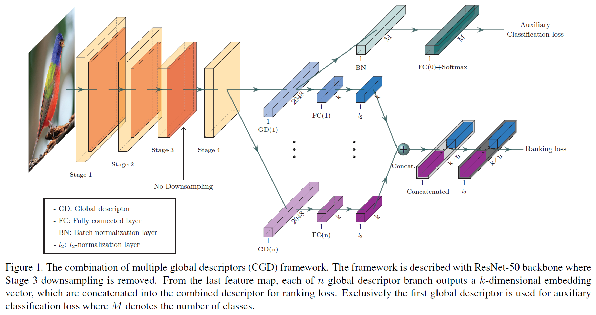

```{r setup, include=FALSE}
knitr::opts_chunk$set(echo = FALSE)
```

## Goal

 - You will have a rough understand of how image retrieval works.

<!-- Add more here -->

## Competitions

 - Google Landmark Retrieval 2019
 - Google Landmark Recognition 2019
 
## Data

 - Images in Training 4,132,914
 - 203,094 Classes (Landmarks)
 - 117,577 test images
 
Not very well curated

There are also distractor images
<!-- Follow up on this. -->

## Evaluation

 - Google Landmark Recognition: Global Average Precision

$$GAP = \frac{1}{M}\sum_{i=1}^N P(i) rel(i)$$

 - Google Landmark Retrieval: Mean Average Precision at 100 

$$mAP@100 = \frac{1}{Q} \sum{q=1}^{Q} \frac{1}{min(mq, 100)} \sum{k=1}^{min(nq,100)} Pq(k) relq(k)$$

Note that this isn't differentiable!

## Award

 - 25K each

## First Place Solution

 - Yinzheng Gu and Chuanpeng Li of the Video++ AI Lab

### Data Cleaning - Classes

 - Just remove the very imbalanced classes (less than 4 examples)
 - Use the model from last year as a feature "descriptors"
 - A descriptor is a vector represented by a generalized-mean pooling layer (see next slide)
 - Within each class, compare the cosine similarity of each pair
 - Classes with no pairs that agree (cosine similarity > 0.5) are removed

### GeM Pooling Layers

 - First Proposed in 2017

$$\mathbf{f}^{(g)}=\left[\mathrm{f}_{1}^{(g)} \ldots \mathrm{f}_{k}^{(g)} \ldots \mathrm{f}_{K}^{(g)}\right]^{\top}, \quad \mathrm{f}_{k}^{(g)}=\left(\frac{1}{\left|\mathcal{X}_{k}\right|} \sum_{x \in \mathcal{X}_{k}} x^{p_{k}}\right)^{\frac{1}{p_{k}}}$$
 Where $\mathcal{X}_{k}$ is the $k$th kernel of the 3D Image tensor and $p_k$ is the pooling parameter, which can be learned. 
 $p_k = 1$ is global average pooling and $p_k -> \infty$ is global max pooling.
 
---
Notes: https://github.com/filipradenovic/cnnimageretrieval-pytorch

## What does this mean?




<aside class="notes">
    Each pair of pictures represents the maximum activations of a different kernel
</aside>


### Data Cleaning - Images

 - Of the images that remain, find the "most agreeable" image (most other images with 0.5 cosine similarity)
 - Only include that image and the images that agree with it
 
 Before Data Cleaning: 4,132,914 Images, 203,094 Classes
 After Data Cleaning: 836,964 Images, 112,782 Classes

## Global CNN Models

 - Used a "Combination of Multiple Global Descriptors" Model


 - Backbone is a ResNet (no max pooling on the 3rd stage)
 - Each global descriptor is a single kernel
 - Connect to a fully connected layer and add $l_2$ regularization
 - Predict ranking loss
 
### Auxilery Classification Loss

 - Only applies to the 1st global descriptor
 - Just a batch norm and temperature scaled softmax <!-- Follow up on this -->

## Attentional Mapping

 - The proposed model concatenates feature maps from several models together
 - Each feature map undergoes GeM plus global average and max pooling and sum-pooled convolutional features <!-- Follow up on sum pooling -->
 - Attention is used to focus the network on the most important features
 - Attention units act as side channels to determine how strong the signal from a single feature is
 <!-- Will need a diagram here -->


## Whitening

 - Attentuated Unsupervised Whitening
 - 
 <!-- More -->
 
 
## Loss Function

 - They actually used two loss functions and summed them together
 - First construct a tuple of a query image, an image from the same class and five images outside of the class
 
 $$\left(I_{q}, I_{p}, I_{n, 1}, \dots, I_{n, 5}\right)$$

### Contrastive loss

 - Clone the network, with the same weights
 - Transform the tuple containing the query image and the positive and negative examples into a list of 2-tuples
 - Compare the 
 
 $$\left(I_{q}, I_{p}\right),\left(I_{q}, I_{n, 1}\right), \ldots,\left(I_{q}, I_{n, 5}\right)$$

$$\mathcal{L}(i, j)=\left\{\begin{array}{ll}{\frac{1}{2}\|\overline{\mathbf{f}}(i)-\overline{\mathbf{f}}(j)\|^{2},} & {\text { if } Y(i, j)=1} \\ {\frac{1}{2}(\max \{0, \tau-\|\overline{\mathbf{f}}(i)-\overline{\mathbf{f}}(j)\|\})^{2},} & {\text { if } Y(i, j)=0}\end{array}\right.$$

### Triplet loss

$$\left(I_{q}, I_{p}, I_{n, 1}\right), \ldots,\left(I_{q}, I_{p}, I_{n, 5}\right)$$

# Bibliography