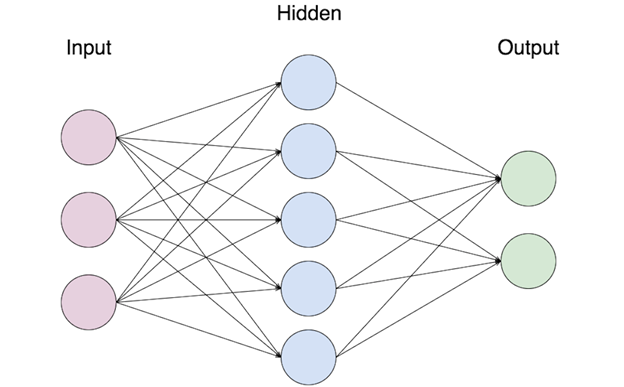
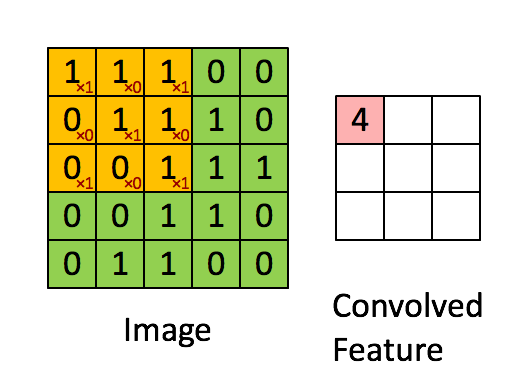
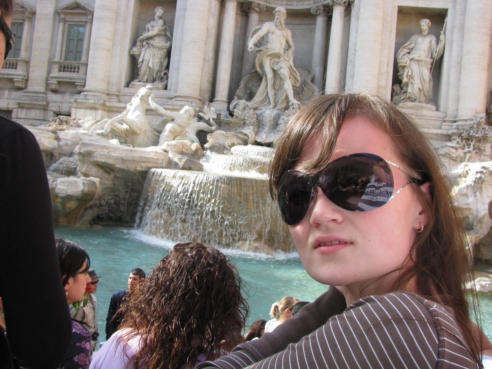

```{r setup, include=FALSE}
knitr::opts_chunk$set(echo = FALSE)
```

## Competitions

<div id="left">
 - **Google Landmark Retrieval 2019:** Given an image, can you find all of the same landmarks in a dataset?
 - **Google Landmark Recognition 2019:** Label famous (and not-so-famous) landmarks in images
</div>

<div id="right">
 
</div>

## Overview


## What are Neural Nets?

<div id="left">
  - They are large arrays of numbers that get multiplied by one another
  - In between those multiplications, we apply a special function called an **activation function**
  - Adjust these numbers using the **chain rule**
</div>

<div id="right">

</div>
<aside class="notes">A hidden layer is just a layer that where the input and outputs aren't directly observed</aside>
<aside class="notes">The more hidden layers, the higher the capacity of the neural network</aside>
<aside class="notes">You can brush up on the math you need with this paper: https://arxiv.org/abs/1802.01528</aside>

## What are Convolutional Neural Networks (CNNs)?

<div id="left">
  - CNNs are neural nets that work well for images
  - Basic features of an image (edges etc.) are useful to know about anywhere in the image
  - This allows the network to **share weights** between different areas of an image
</div>

<div id="right">
  
</div>
<aside class="notes">Other applications: Natural language processing, Video</aside>

## First Layer Activations


## Data

<div id="left">
 - Images in Training: 4,132,914 (0.5 TB)
 - **203,094 Landmarks**
 - 117,577 test images
 - Not very well curated
 - There are also distractor images (photos of nothing)
</div>

<div id="right">

</div>


## Distractors


## Images are different sizes


## Images have different lighting conditions


## Some images are orientated the wrong way


## Evaluation

 - Landmark Recognition: Global Average Precision (MAP@1)
 - Landmark Retrieval: Mean Average Precision at 100 
 - $M$ is number of query images with landmarks
 - $N$ total number of predictions across all queries
 - $P(i)$ Precision at rank $i$
 - $rel(i)$ an indicator function if the prediction is correct


$$GAP = \frac{1}{M}\sum_{i=1}^N P(i) rel(i)$$

## Mean Average Precision Illustrated


## Data Cleaning - Classes

 - Just remove the very imbalanced classes (less than 4 examples)
 - Use the model from last year extract **image descriptors**
 - Within each class, compare the cosine similarity of each pair
 - Classes with no pairs that agree (cosine similarity > 0.5) are removed

<aside class="notes">
- A descriptor is a vector represented by a generalized-mean pooling layer (see next slide)
</aside>

## Data Cleaning - Images

<div id="left">
 - Of the images that remain, find the "most agreeable" image (most other images with 0.5 cosine similarity) in each class
 - Only include that image and the images that agree with it
 
 - **Before Data Cleaning:** 4,132,914 Images, 203,094 Classes
 - **After Data Cleaning:** 836,964 Images, 112,782 Classes
</div>

<div id="right">

</div>

## How Do We Find the Distance between Images?

## GeM Pooling Layers

 - First Proposed in 2017


$$\mathbf{f}^{(g)}=\left[\mathrm{f}_{1}^{(g)} \ldots \mathrm{f}_{k}^{(g)} \ldots \mathrm{f}_{K}^{(g)}\right]^{\top}, \quad \mathrm{f}_{k}^{(g)}=\left(\frac{1}{\left|\mathcal{X}_{k}\right|} \sum_{x \in \mathcal{X}_{k}} x^{p_{k}}\right)^{\frac{1}{p_{k}}}$$
 Where $\mathcal{X}_{k}$ is the $k$th kernel of the 3D Image tensor and $p_k$ is the pooling parameter, which can be learned. 
 $p_k = 1$ is global average pooling and $p_k -> \infty$ is global max pooling.

<aside class="notes">
Notes: https://github.com/filipradenovic/cnnimageretrieval-pytorch
</aside>
## What does this mean?

 - These GeM activations are combined with self-attention to identify salient keypoints 


<aside class="notes">
    Each pair of pictures represents the maximum activations of a different kernel
</aside>


## Attentional Mapping

 - Self-Attention in CNNs was first adopted in GANs
 - Helps model the relationship between pixels far away from each other (global relationships)
 - Handles detail better than traditional CNN


 
## Introduction to Attention

 - Multiply the activations of a layer by learned weights and softmax the results
 - As the network is trained, the learned weights will tend to focus on the most salient features of an image


<aside class="notes">
	On the left is the original image. The two photos in the image are activations of networks without attention.
	The photo on the right side is using attention
</aside>

## Attention Code

<!-- https://pytorch-nlp-tutorial-ny2018.readthedocs.io/en/latest/day2/patterns/attention.html -->

```python
class Attention(nn.Module):
    def __init__(self, attention_size):
        super(Attention, self).__init__()
        self.attention = new_parameter(attention_size, 1)

    def forward(self, x_in):
        # after this, we have (batch, dim1) with a diff weight per each cell
        attention_score = torch.matmul(x_in, self.attention).squeeze()
        attention_score = F.softmax(attention_score).view(
          x_in.size(0), x_in.size(1), 1
        )
        scored_x = x_in * attention_score

        # now, sum across dim 1 to get the expected feature vector
        condensed_x = torch.sum(scored_x, dim=1)

        return condensed_x
```

## Global CNN Models

 - Used a "Combination of Multiple Global Descriptors" Model


<aside class="notes">
- Global descriptors are rough-grain characteristics of a whole image 
 - Each global descriptor is a single kernel
 - Connect to a fully connected layer and add $l_2$ regularization
 - Predict ranking loss
</aside>


## Global CNN Model Backbones

Team JL used seven models as backbones and ensembled them
 
<div id="left">
 1. ResNet-101
 2. ResNeXt-101
 3. SE-ResNet-101
 4. SE-ResNeXt-101
 5. SENet-154
 6. Deep Image Retrieval (DIR)
 7. Previous 6 + Attentuated Unsupervised Whitening (AUW)
</div>

<div id="right">

</div>
 
 
<aside class="notes">
 SE stands for Squeeze-and-Excitation. A concept similar to attention
 Train weights to determine how much much weight to put each convolutional kernel
 AUW is like PCA for descriptors
</aside>

## Auxiliary Classification Loss

 - Only applies to the 1st global descriptor
 - Apply batchnorm and then a temperature-scaled softmax (for smoothing) 
 - Useful in semi-supervised or weakly supervised situations
 

 
## Loss Function

 - They actually used two loss functions and summed them together
 - First construct a tuple of a query image, an image from the same class and five images outside of the class
 - They rely on cloned networks with the same weights (known as Siamese networks)
 
 $$\left(I_{q}, I_{p}, I_{n, 1}, \dots, I_{n, 5}\right)$$

## Contrastive loss

 - Transform the tuple containing the query image and the positive and negative examples into a list of 2-tuples
 - If the images are in the same class, the loss the half the norm of the difference of two descriptors
 - Otherwise, subtract the difference of the two descriptors from a margin hyperparameter
 
 $$\left(I_{q}, I_{p}\right),\left(I_{q}, I_{n, 1}\right), \ldots,\left(I_{q}, I_{n, 5}\right)$$

$$\mathcal{L}(i, j)=\left\{\begin{array}{ll}{\frac{1}{2}\|\overline{\mathbf{f}}(i)-\overline{\mathbf{f}}(j)\|^{2},} & {\text { if } Y(i, j)=1} \\ {\frac{1}{2}(\max \{0, \tau-\|\overline{\mathbf{f}}(i)-\overline{\mathbf{f}}(j)\|\})^{2},} & {\text { if } Y(i, j)=0}\end{array}\right.$$


## Triplet loss

 - 3-tuples instead of 2-tuples
 - Suggested to be a smoother function

$$\left(I_{q}, I_{p}, I_{n, 1}\right), \ldots,\left(I_{q}, I_{p}, I_{n, 5}\right)$$

$$\mathcal{L}(i)=\sum_{i=1}^{N}\left[\left\|f_{i}^{q}-f_{i}^{p}\right\|^{2}-\left\|f_{i}^{q}-f_{i}^{n}\right\|^{2}+\alpha\right]_{+}$$

 - Triplet loss is very similar to contrastive loss. I don't know why the JL decided to use both losses


## What does a Siamese network look like?


## Siamese Network Code

```python
class SiameseNetwork(nn.Module):
    def __init__(self):
        super(SiameseNetwork, self).__init__()
        self.cnn1 = nn.Sequential(...)

        self.fc1 = nn.Sequential(...)

    def forward_once(self, x):
        output = self.cnn1(x)
        output = output.view(output.size()[0], -1)
        output = self.fc1(output)
        return output

    def forward(self, input1, input2):
        output1 = self.forward_once(input1)
        output2 = self.forward_once(input2)
        return output1, output2

```

## Contrastive Loss Code

```python
class ContrastiveLoss(torch.nn.Module):
    def __init__(self, margin=2.0):
        super(ContrastiveLoss, self).__init__()
        self.margin = margin

    def forward(self, output1, output2, label):
        euclidean_distance = F.pairwise_distance(output1, output2, keepdim = True)
        loss_contrastive = torch.mean(
            (1-label) * torch.pow(euclidean_distance, 2) +
            (label) * torch.pow(
                torch.clamp(self.margin - euclidean_distance, min=0.0), 
            2)
        )

        return loss_contrastive
```

<aside class="notes">
https://github.com/harveyslash/Facial-Similarity-with-Siamese-Networks-in-Pytorch/blob/master/Siamese-networks-medium.ipynb
</aside>


## Local CNN Model

<div id="left">
 - Local descriptors describe a small patch of an image with fine detail
 - After a first pass with the "global" network, a local network attempts to re-rank the top 10 candidates
 - Uses a **Detect-to-Retrieve** (D2R) network, building on a Deep Local Features architecture (DELF)
</div>

<div id="right">

</div>

## Deep Local Features

<div id="left">
 - DELF uses attention in a similar way to the global model
 - DELF learns keypoints that are relevant only to the class of object
 - These keypoints tend to be invariant to pose and viewpoint
</div>

<div id="right">
 
</div>
 
## Detect-to-Retrieve

<div id="left">
 - Combines DELF with Aggregated Selective Match Kernels
 - Network simulatenously proposes regions of interest and salient image features
 - A Faster-RCNN backbone is used for region proposal
</div>

<div id="right">

</div>

## At Test time: Step 1 Global Search

<div id="left">
 - Using only the global model, compute the similarity between ALL test and train images
 - Keep the top 10 closet neighbours for each test image
 - A soft voting scheme of the top 5 images determines the class
</div>

<div id="right">

</div>


## Step 2: Local Search
<div id="left">
 - Run the D2R algorithm on the previous identified top 10 candidates
 - Vote based on this
</div>


<div id="right">

</div> 

## Step 3: Re-Ranking (Team JL's Secret Sauce)
<div id="left">
 - Compare the Rank-1 image with the the top 20000 predictions using the D2R
 - Append any highly similar images to right behind rank-1, with slightly less confidence than the rank-1 image but more than rank-2
 - Do this the previous Rank-2 image as well
</div>


<div id="right">

</div>

<aside class="notes">
- All this work and they haven't dealt with distractors!
</aside>

## Why would re-ranking work

 - They believe that they're rank-1 image was very often right
 - They also believe that they were getting most of images in the proper class within the first 20000 photos
 - The distractors are diluting their score by being middle-ranked


<div id="right">

</div>

## Backbone Results


## Process Results


## Overview Again


# Bibliography